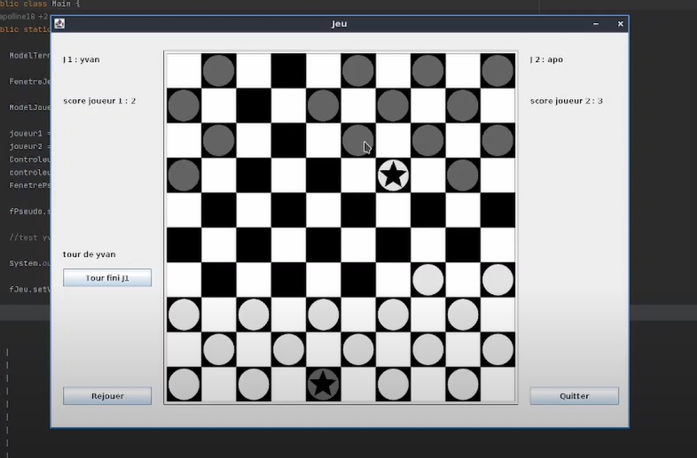

# dame

[Vidéo de démonstration](https://youtu.be/8_31gb4w220)

- déplacement des pions
- compteur de score
- transformation des pions en dame
- système de tour successif entre les deux joueurs
- aide
- pseudo personnalisable
- réinitialisation de la partie
- sauvegarde dans un fichier texte l'état de la partie quand on quitte le jeu

  